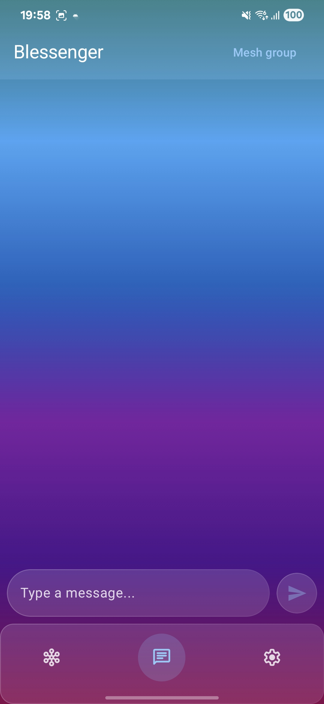
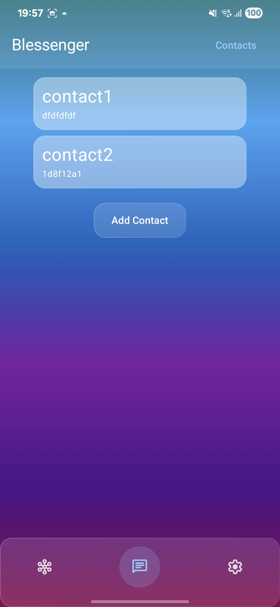
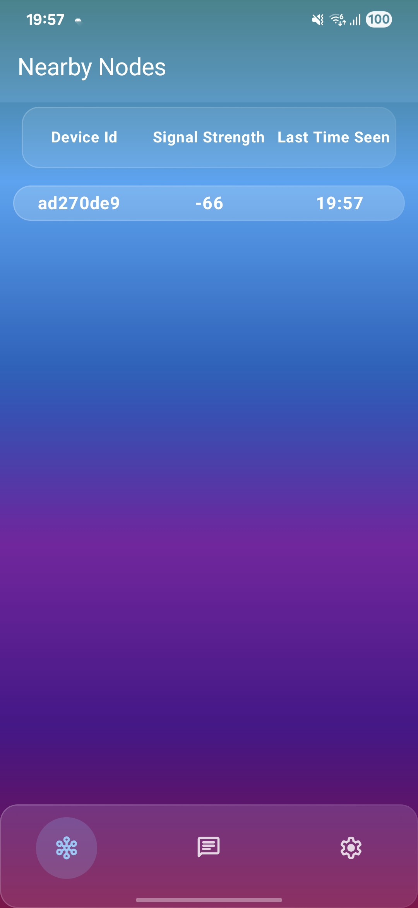
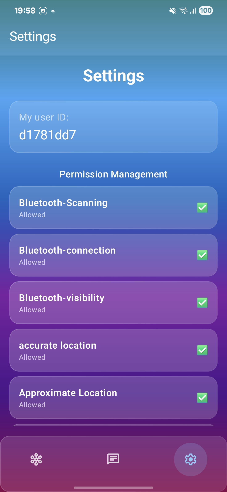

# Blessenger

**An offline messenger for Android that sends messages from phone to phone over Bluetooth Low Energy.**

No internet, cell signal, Wi-Fi, servers or pairing. Every phone running Blessenger is a node in a mesh, and messages hop from node to node until they reach the people they're meant for.

## Highlights

- **Bluetooth Low Energy.** You can chat through Bluetooth LE without the Internet.
- **Multi-hop relaying.** Every phone re-broadcasts the messages it gets, so a message can be relayed up to 7 times to reach people outside the sender's range.
- **Mesh group chat.** A public channel shared with everyone who can be reached by hopping.
- **Direct messages.** Add contacts by ID and chat P2P. Conversations are saved on the device.
- **Nearby nodes.** Discover nearby nodes and add them to contacts.
- **Runs in the background.** A foreground service keeps routing messages in the background.

## Tech stack

- Kotlin with coroutines and Flow
- Jetpack Compose and Material 3
- Navigation 3
- Room 3, with KSP for code generation
- Android BLE extended advertising and scanning APIs
- Gradle Kotlin DSL with a version catalog ([`gradle/libs.versions.toml`](gradle/libs.versions.toml))

## Screenshots

|                             Mesh group                             |                            Contacts                             |                           Nearby nodes                           |                            Settings                             |
|:------------------------------------------------------------------:|:---------------------------------------------------------------:|:----------------------------------------------------------------:|:---------------------------------------------------------------:|
|  |  |  |  |

##  Build Requirements

- Android Studio with the Android SDK for API 37 
- JDK 21 for the Gradle daemon
- At least two Android phones running Android 12 (API 31) or newer, with Bluetooth 5 (LE extended advertising) support

Install the app on two phones, turn on Bluetooth and Location on both, and send a message in **Mesh group** to see it arrive.
